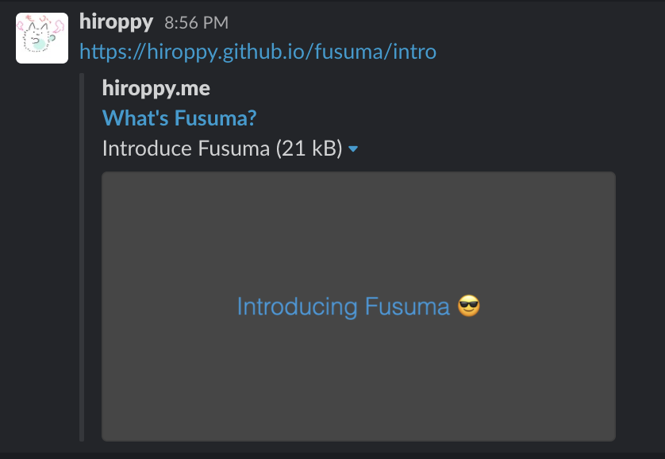

<div align="center">
  
</div>

<div align="center">
  <strong>A tool to create slides easily for you ✍ ️</strong>
</div>

<br />

[](https://www.npmjs.com/package/fusuma)
[](https://dev.azure.com/hiroppy/fusuma)
[](https://codecov.io/gh/hiroppy/fusuma)

## **Please see [Website](https://hiroppy.github.io/fusuma/) for more details!**

## Features

- Zero Config
- Markdown and [MDX](https://github.com/mdx-js/mdx)
- Themes
- Supporting Code syntax Highlight, MathJax, Diagrams, and Flowcharts
- Full supporting for SEO and OGP
- Customizable JavaScript and CSS
- Sidebar having agenda and some features

## Modes

- Development Mode
  - Running with HMR
  - Just write Markdown and CSS
- Build Mode
  - Rendering to html and optimize js,css,md
  - Generating an image of slides as `og:image` automatically
- [Presentation Mode](#presenter-mode)
  - Speaker Note
  - Timer
  - Recording your page actions and voice
  - Using a Fluorescent Marker on the slides
- [Live Mode](#live-mode)
  - Streaming tweets and comments
- Deploying to GitHub Pages
- Exporting slides as PDF
- Live
  - Can make a speech while streaming a comment on Twitter

## Demos

[Introducing Fusuma](https://hiroppy.github.io/fusuma/intro) [[repository](/samples/intro)]

[](https://gitpod.io/#https://github.com/hiroppy/fusuma/blob/master/samples/intro/slides/0-title.md)

## Getting Started

[Getting Started/Preparation](https://hiroppy.github.io/fusuma/docs/getting-started/preparation)

Node versions > v12

Just execute the following two lines for executing, generating and deploying slides!

```sh
$ npm i fusuma -D
# not mandatory but it's one easy method
$ npx fusuma init
$ tree -a
.
├── .fusumarc.yml
├── slides
│   └── 0-title.md
└── style.css

$ npx fusuma start # let's start writing slides!

# --- executable tasks---
$ npx fusuma init     # create scaffold
$ npx fusuma start    # run server for development
$ npx fusuma build    # build slides for production
$ npx fusuma deploy   # deploy to github pages
$ npx fusuma pdf      # export as PDF
$ npx fusuma live     # start live mode
```

When `npx fusuma start` is executed, fusuma will create a slide as follows and serve `http://localhost:8080` and then you can write slides with HMR.


Fusuma adds a Sidebar like below. When you set section titles, fusuma shows them on here.


When you set the URL of the deployment destination at the production stage, fusuma generate og:image using a first slide automatically.



## Markdown and MDX

Fusuma uses [remark](https://github.com/remarkjs/remark).

```markdown
## Hello

This is the first slide.

---

## 🤭

This is the second slide.
```

Also, you can use React components!

```markdown
<!-- title.mdx -->

import { Sample } from './scripts/Sample';

<Sample />

---

## 🤭

This is the second slide.
```

```js
// Sample.js
export const Sample = () => <p>Hello from jsx!!</p>;
```

## Presenter Mode

[Modes/Presenter](https://hiroppy.github.io/fusuma/docs/modes/presenter)

This feature uses experimental APIs so please use Chrome or Firefox.

- [Presentation API](https://developer.mozilla.org/en-US/docs/Web/API/Presentation_API) (Chrome, Firefox)
- [Screen Capture API](https://developer.mozilla.org/en-US/docs/Web/API/Screen_Capture_API/Using_Screen_Capture) (Chrome, Firefox)

You can see your Note for each slide and the next slide on the Host screen.


### Features

- Shows your slide note
- Sets a timer
- Records your actions and voice, and do time-travel
- Draws lines on the slide

### Recording Your Actions


Video -> [Recording Your Voice](https://hiroppy.github.io/fusuma/docs/modes/presenter#recording-your-voice)

### Drawing Lines

When you write characters on the host side, it will be reflected on the client side in real time.


## Live Mode

[Modes/Live](https://hiroppy.github.io/fusuma/docs/modes/live)

Fusuma can fetch tweets from Twitter. In addition, fusuma have an api endpoint.  
If you specify a `keyword` and `authentication keys`, fetching from twitter will be enabled.  
Since comments can be sent to fusuma itself, you can use in the private case.  
Also, this mode can run with Presenter Mode.


## Audits

[This slide](https://hiroppy.github.io/fusuma/issues/#slide=1) is very simple, so this is a measure of the maximum performance fusuma can deliver.


The values of `Accessibility` and `Best Practices` depend on the user because the user writes HTML(Markdown).  
If you want to make `SEO` score 100%, you should fill in the `.fusumarc.yml`.

## Examples

- [hiroppy/fusuma/intro](/samples/intro)
- [hiroppy/slides](https://github.com/hiroppy/slides)
